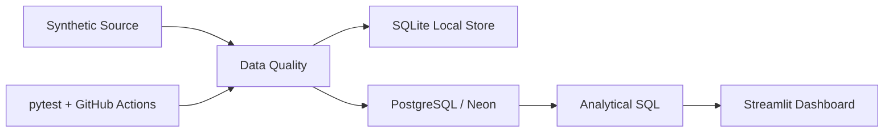
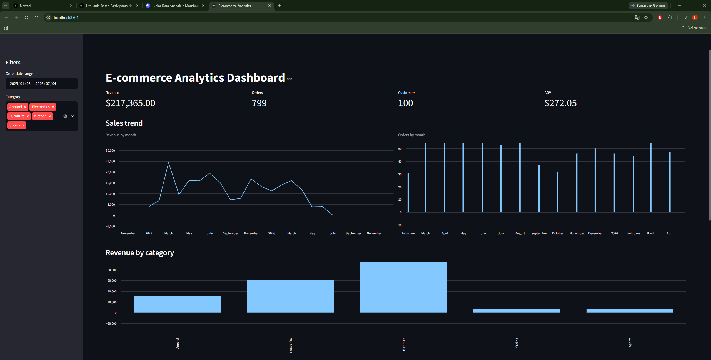
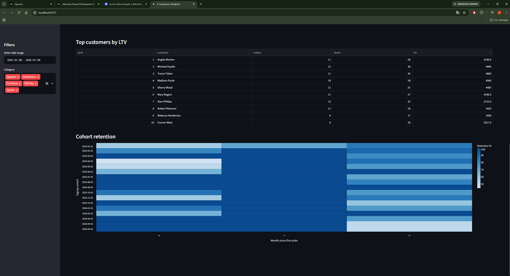

# E-commerce Data Engineering Pipeline


An end-to-end portfolio project that demonstrates **Python ETL, PostgreSQL, SQLite, data quality, idempotent loading, analytical SQL, testing, CI and a lightweight BI dashboard**.

## Architecture



## What this project demonstrates

- deterministic synthetic e-commerce data generation;
- source IDs for safe incremental/upsert-style loading;
- idempotent `UPSERT` loads instead of dropping tables on every run;
- relational constraints and indexes;
- data-quality checks before loading;
- KPI, category, LTV and cohort-retention analytics;
- PostgreSQL-compatible SQL;
- automated tests;
- Docker / Docker Compose;
- GitHub Actions CI;
- Streamlit dashboard.

## Project structure

```text
core/
  analytics.py
  config.py
  db_manager.py
  generator.py
  loaders.py
  pipeline.py
  postgres_manager.py
  quality.py
  schema.py
dashboard/
  app.py
sql_queries/
  sales_metrics.sql
  customer_ltv.sql
  cohort_analysis.sql
tests/
  test_generator.py
  test_sqlite_pipeline.py
.github/workflows/ci.yml
Dockerfile
docker-compose.yml
Makefile
requirements.txt
```

## Data model

`users` 1---N `orders` N---1 `products`

Every entity also has a stable `source_*_id`. This separates source identity from database-generated surrogate keys and makes repeated loads safe.

## Run locally

1. Create an environment:

```bash
python -m venv venv
```

Windows:

```bash
venv\Scripts\activate
```

macOS/Linux:

```bash
source venv/bin/activate
```

2. Install dependencies:

```bash
pip install -r requirements.txt
```

3. Copy `.env.example` to `.env` and set `DATABASE_URL`.

4. Run the full pipeline:

```bash
python -m core.pipeline
```

Local SQLite only:

```bash
python -m core.pipeline --skip-postgres
```

Reset both databases (destructive; use once when migrating an old local/cloud database):

```bash
python -m core.pipeline --reset
```

Normal runs do **not** clear either database. They use stable `source_*_id` values and PostgreSQL/SQLite UPSERTs. Re-running the same `--seed` is therefore idempotent.

For an existing PostgreSQL database created by the older version of this project, run the command above once to recreate the schema with `source_*_id` columns.

Generate a new deterministic batch:

```bash
python -m core.pipeline --users 250 --orders 2500 --seed 100
```

Using a new seed produces new source IDs, so the pipeline can append another batch without duplicating a previous batch. Re-running the same seed is idempotent.

## Tests

```bash
pytest -q
```

The CI workflow runs these tests automatically on push and pull request.

## Dashboard

After configuring `DATABASE_URL`:

```bash
streamlit run dashboard/app.py
```




The dashboard shows revenue, orders, active customers, AOV, category performance and top customers by LTV.

## Data quality

Before any load, the pipeline validates:

- non-empty datasets;
- uniqueness of source IDs;
- non-negative product prices;
- positive order quantities;
- valid user references;
- valid product references.

The database also enforces foreign keys, unique constraints and `CHECK` constraints.

## Analytics

### Sales KPIs
- total revenue;
- orders;
- active customers;
- average order value.

### Customer LTV
Ranks customers by cumulative order value with a SQL window function.

### Cohort retention
Groups customers by registration month and measures activity in subsequent months.

### Category performance
Compares units sold and revenue contribution by product category.

## Production roadmap

This project intentionally stops short of adding heavy infrastructure for its own sake. Natural next steps would be:

1. real source ingestion from an API/object storage;
2. incremental extraction using `updated_at` watermarks;
3. staging → core → marts layers;
4. orchestration with Airflow/Prefect;
5. dbt models and tests;
6. Great Expectations or Soda for richer data-quality reporting;
7. cloud object storage and a warehouse;
8. alerting/observability and pipeline run metadata.

## Security note

Never commit `.env`, database credentials or local database files. `.gitignore` excludes them.
